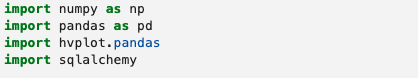
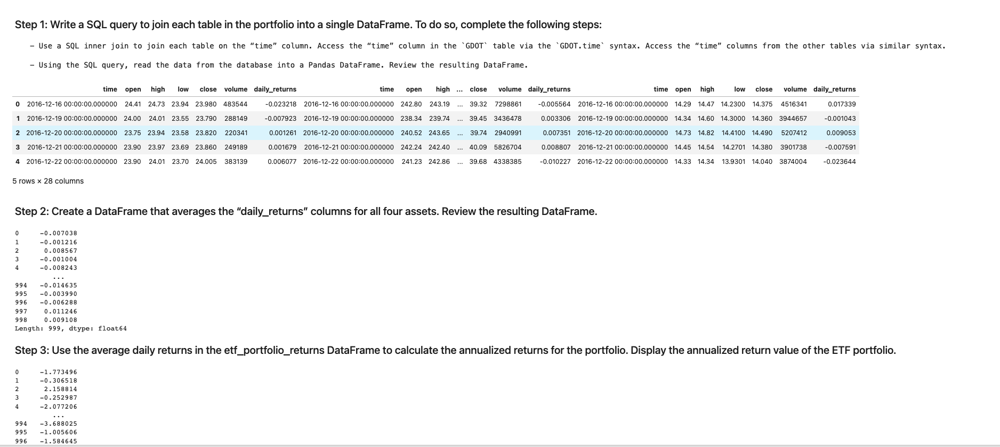
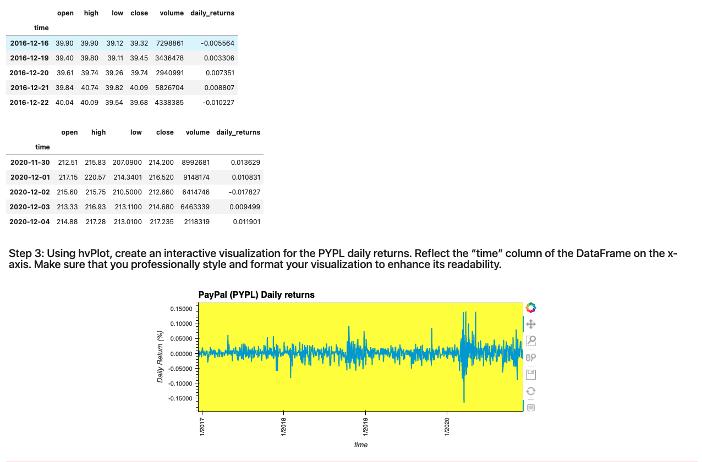
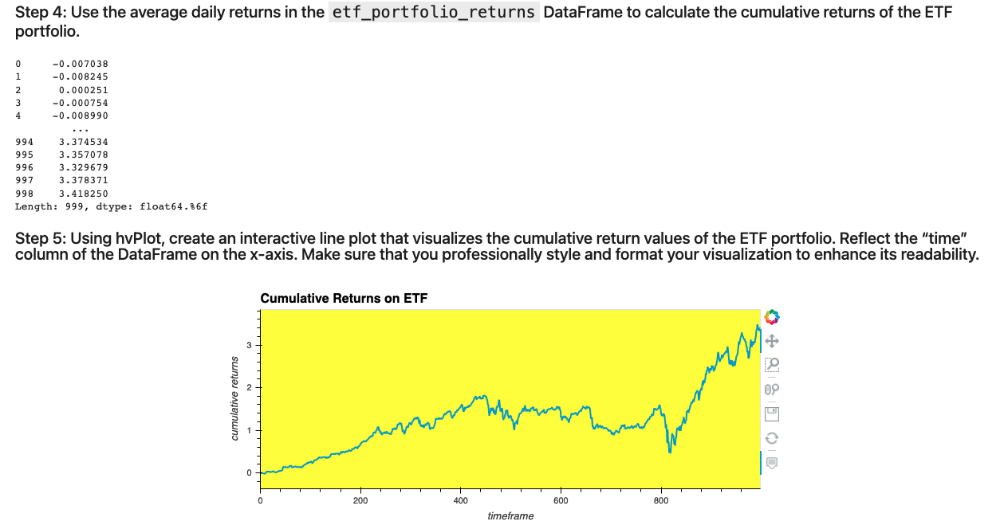

# ETF-Analyzer
---

 

The program is designed to interact with a financial database and create web application based on different data analysis of the four different hypothetical ETFs.

The program is capable of reading different databases and allows 

---

## Technology ##
The following programming languages were used to design the program:
SQL, Python, and the Voilà library. 

SQL allows the program to work with database, while python was used to codes for the evaluations. Voila allowed to visually present the data in aesthetic way.

**Installation**

To run the program please import the following functions and libraries:  

---
**Usage**

The progaram extracts the data from database containing different hypothetical ETF over a period of four years(2016-2020). Based on the weekly data from the database, the program estimates its performances. As a part of analysis, we calculate the changes over the years, and chart them into figures to make it communiate the trends more visually.

Voila allows the program to execute the data as a web application. 

---

**Babin Shrestha**
